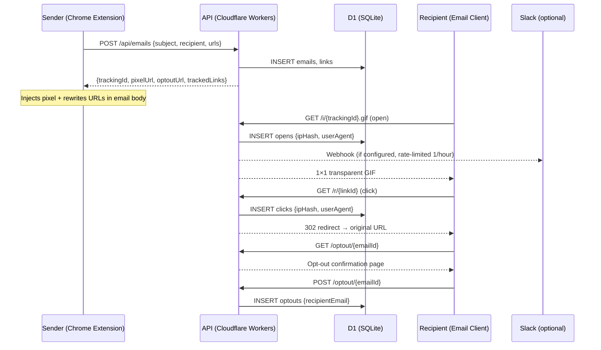

# 📬 mailtrack-pf

> **Open-source email tracking, $0/month, hosted on Cloudflare**

Gmail からの送信メールの**開封・リンククリックを追跡**できる Chrome 拡張機能 + ダッシュボード。データ主権を自分側に保持しつつ、月額運用コスト ¥0 で稼働させる。

[](https://github.com/dkamehat/mailtrack-pf/actions) []() []() []()

[](https://deploy.workers.cloudflare.com/?url=https://github.com/dkamehat/mailtrack-pf)


---

## Why I Built This

As a product manager handling daily business communications, I send dozens of emails daily — project updates to executives, coordination with 74-person teams, follow-ups with external partners. I had no idea if anyone actually read them.

I was spending **2-3 hours per week** calling and Slack-messaging people just to confirm they'd seen my email. The existing solutions didn't work for me: Mailtrack and MailSuite cost $5-10/month per account, and worse, they route your tracking data through their servers. For someone handling sensitive business communications and job applications, that was a non-starter.

So I built my own. The technical bet was to go **all-in on Cloudflare's free tier** — Workers for the API, D1 (SQLite at the edge) for storage, Pages for the dashboard. The entire stack costs $0/month with ~1000x headroom on every quota. I chose **AGPLv3** specifically to prevent proprietary SaaS forks while keeping the code freely available for self-hosting — the same model that works for Plausible Analytics and Cal.com.

What surprised me most during development:

- **Gmail's image proxy** caches tracking pixels, making repeat-open detection unreliable. This is a fundamental limitation of pixel-based tracking that no tool can fully solve.
- **Recipient privacy controls actually work.** Apple Mail Privacy Protection, image-blocking, and Proton Mail all defeat tracking trivially. I documented this prominently because I believe recipients should always retain control.
- **The ethics section took longer than the API.** Writing the Prohibited Use policy and GDPR compliance documentation was harder than implementing the 12 API endpoints. But it's the part I'm most proud of — this tool would be irresponsible without it.

Built in one week as a solo PM. 29 tests, TypeScript strict mode, CI green. The entire development process is documented in ADRs and a [Claude Code case study](docs/CLAUDE-CODE-CASE-STUDY.md).

---

## 🏗️ アーキテクチャ

```
┌─────────────────────┐    ┌─────────────────────┐
│  Chrome Extension   │    │  Recipient Inbox    │
│  (Gmail MV3)        │    │  (opens / clicks)   │
└──────────┬──────────┘    └──────────┬──────────┘
           │ POST /api/emails         │ GET /pixel, /r
           ↓                          ↓
       ┌──────────────────────────────────────┐
       │       Cloudflare Workers (Hono)      │
       │  API · pixel handler · redirector    │
       └──────────────────┬───────────────────┘
                          │ Drizzle ORM
                          ↓
                  ┌───────────────┐      ┌──────────────────┐
                  │  Cloudflare   │ ───→ │  React Dashboard │
                  │  D1 (SQLite)  │      │  on CF Pages     │
                  └───────────────┘      └──────────────────┘
```

**全レイヤー Cloudflare 上で完結。エッジで DB アクセスするためピクセル応答 P95 < 30ms。**

---

## 📦 機能一覧

### API（Cloudflare Workers + Hono）v0.3.0
- `POST /api/emails` — メール登録、tracking_id + pixel URL + tracked links + opt-out URL を返却
- `GET /pixel/:id.gif` — 1×1 透明 GIF 返却 + 開封記録（IP は SHA-256 ハッシュ化）
- `GET /r/:id` — 原 URL に 302 リダイレクト + クリック記録
- `GET /api/emails` — 送信履歴一覧（開封・クリック数付き、pagination 対応）
- `GET /api/emails/:id` — 個別メール詳細（開封タイムライン + リンク別クリック数）
- `POST /api/emails/:id/optout` — 受信者オプトアウト（API 経由）
- `GET/POST /optout/:emailId` — 受信者向け公開 opt-out ページ（認証不要）
- `GET /api/account/usage` — 月間送信数 / 上限
- `DELETE /api/account/data` — GDPR データ削除
- `GET /api/account/data` — GDPR データエクスポート
- `POST /api/auth/*` — Better Auth 認証（hosted モード）
- `GET /privacy` — プライバシーポリシー
- `GET /terms` — 利用規約

### Chrome 拡張機能（Manifest V3）
- Gmail Compose 画面に Track ON/OFF トグルボタン
- 送信時に API POST → ピクセル自動挿入 + URL 書き換え
- Sent フォルダに ✓（未読）/ ✓✓（既読）ステータスアイコン
- 設定ポップアップ（API URL、API Key、Slack Webhook）


### ダッシュボード（React + Vite）
- メール送信履歴の時系列表示
- 各メールの開封タイムライン（UserAgent・Gmail Proxy 判定）
- 開封率・クリック率の集計表示
- 受信者・件名・タグで検索・フィルタ

### マルチテナント認証（Phase 2）
- Better Auth 統合（email/password + Google OAuth）
- API キー認証（Chrome 拡張機能用、SHA-256 ハッシュ保存）
- `HOSTING_MODE` 切り替え: self（OSS 版） / hosted（公式版）
- 月間送信上限（無料: 500 通 / 月、新規 24h: 10 通）
- 自動 BAN（opt-out 10 件超で凍結）
- GDPR データ削除・エクスポート

### 観測性・セキュリティ
- X-Request-ID / X-Response-Time ヘッダー
- レート制限（100 req/min per IP）
- Slack Webhook 開封通知（同一メール 1 時間以内は抑制）
- CORS origin 制限（`ALLOWED_ORIGINS` 環境変数）
- Cloudflare Workers Analytics（wrangler.toml で有効化済み）

---

## 💰 ¥0 運用の仕組み

| サービス | 無料枠 | 想定使用 | 余裕度 |
|---|---|---|---|
| Cloudflare Workers | 10 万 req/日 | 100 req/日 | **1000×** |
| Cloudflare D1 | 5GB · 500 万 read/日 | < 1MB · 100 read/日 | **5 万×** |
| Cloudflare Pages | 帯域無制限 · 500 ビルド/月 | 30 ビルド/月 | **16×** |
| GitHub Public | 無制限 | — | ∞ |

**合計: ¥0/月。SaaS 比 3 年累計で $180〜$864 削減（[ADR-002](docs/ADR-002-free-tier-operations.md)）**

---

## 🛠️ 技術スタック

| レイヤー | 技術 |
|---|---|
| Chrome 拡張 | Manifest V3 · Service Worker · Content Script |
| API | Cloudflare Workers · Hono v4 |
| DB | Cloudflare D1 (SQLite) · Drizzle ORM |
| ダッシュボード | React 19 · Vite 6 · Cloudflare Pages |
| モノレポ | Turborepo · pnpm |
| 認証 | Better Auth (D1 直接接続) |
| テスト | Vitest · @cloudflare/vitest-pool-workers (29 tests) |
| 観測性 | X-Request-ID · X-Response-Time · Workers Analytics |
| CI/CD | GitHub Actions |
| ライセンス | AGPL-3.0-or-later |

---

## 🚀 セットアップ

### One-Click Deploy (Fork & Deploy)

1. Fork this repo
2. Add GitHub Secrets: `CLOUDFLARE_API_TOKEN`, `CLOUDFLARE_ACCOUNT_ID`
3. Go to Actions → "Deploy to Cloudflare" → Run workflow

### Manual Setup

```bash
# Clone
git clone https://github.com/dkamehat/mailtrack-pf.git
cd mailtrack-pf
pnpm install

# Cloudflare D1 セットアップ
pnpm wrangler login
pnpm wrangler d1 create mailtrack-pf-db
# → wrangler.toml の database_id を更新

# マイグレーション
pnpm db:generate
pnpm db:migrate:local    # ローカル D1
pnpm db:migrate:remote   # 本番 D1
pnpm db:seed:self        # self テナント + ユーザー投入

# 開発サーバー起動
pnpm dev

# テスト
pnpm test
pnpm type-check

# Chrome 拡張のインストール
# 1. chrome://extensions を開く
# 2. 「デベロッパーモード」を ON
# 3. 「パッケージ化されていない拡張機能を読み込む」で apps/extension/ を選択
```

詳細は [SETUP.md](SETUP.md) 参照。

---

## 📸 Screenshots

### Landing & Sign In
| Landing | Google Login |
|---------|-------------|
|  |  |

### Onboarding (3 steps)
| 1. Generate API Key | 2. Install Extension | 3. Send Test Email |
|---------------------|---------------------|-------------------|
|  |  |  |

### Chrome Extension
| Extension Popup | Chrome Extensions Page |
|----------------|----------------------|
|  |  |

### Gmail & Dashboard
| Gmail Compose (Track ON) | Dashboard |
|--------------------------|-----------|
|  |  |

### Privacy Controls
| Opt-out Page | Opted Out | Already Opted Out |
|-------------|-----------|-------------------|
|  |  |  |

---

## 📚 ドキュメント

| ドキュメント | 内容 |
|---|---|
| [ADR-001](docs/ADR-001-stack-selection.md) | 技術スタック選定の意思決定記録 |
| [ADR-002](docs/ADR-002-free-tier-operations.md) | 無料運用設計の意思決定記録 |
| [ADR-003](docs/phase2/ADR-003-multi-tenant-architecture.md) | マルチテナント設計 |
| [ADR-004](docs/phase2/ADR-004-oss-licensing-and-hosting-model.md) | AGPLv3 採用 |
| [CHECKLIST.md](CHECKLIST.md) | Day 1 実行チェックリスト |
| [API-REFERENCE.md](docs/API-REFERENCE.md) | API リファレンス |
| [GOOGLE-OAUTH-SETUP.md](docs/GOOGLE-OAUTH-SETUP.md) | Google OAuth セットアップガイド |
| [SELF-HOST-GUIDE.md](docs/SELF-HOST-GUIDE.md) | セルフホスト手順 |
| [SHOW-HN.md](docs/SHOW-HN.md) | Show HN 投稿文 |
| [CLAUDE-CODE-CASE-STUDY.md](docs/CLAUDE-CODE-CASE-STUDY.md) | Claude Code 活用事例 |

---

## ⚠️ Responsible Use & Legal Considerations

> *Legal and ethics sections are written in English for international accessibility. 他のセクションは日本語です。*

Email tracking is a legally and ethically sensitive practice. This tool is designed for legitimate use cases only.

### Intended Use Cases
- Tracking opens/clicks on **your own** sent emails (e.g., follow-up timing)
- Marketing emails where recipients have **explicitly opted in** to receive communications
- Internal team communications where tracking is disclosed in advance

### Prohibited Use

**The following uses violate the intended use of this software:**

- **Intimate partner surveillance** — tracking emails to monitor a partner's behavior (potential DV/abuse vector)
- **Non-consensual employee monitoring** — tracking employee emails without informed written consent
- **Journalist/activist/source tracking** — any use that could compromise press freedom or endanger individuals
- **Stalking or harassment** — using tracking data to intimidate, threaten, or harass recipients
- **Mass unsolicited email tracking** — attaching tracking pixels to spam or bulk unsolicited emails

If you become aware of such misuse, please report it via GitHub Issues.

> **Note:** While this software is AGPLv3-licensed, the authors strongly request that users honor the prohibited uses listed above as a matter of ethics. Reports of prohibited use will result in public disavowal and removal of support.

### Privacy & Compliance

- **GDPR (EU)**: The sender must inform recipients that tracking is in use. IP addresses are pseudonymized via SHA-256 hashing (not fully anonymized; this enables deduplication while reducing direct PII exposure). Full data deletion available via [`DELETE /api/account/data`](https://github.com/dkamehat/mailtrack-pf/blob/2a06328/apps/api/src/routes/gdpr.ts) (GDPR Article 17).
- **個人情報保護法 (Japan)**: Raw IP addresses are never stored — only SHA-256 [pseudonymized hashes](https://github.com/dkamehat/mailtrack-pf/blob/2a06328/apps/api/src/lib/hash.ts). Email body content is never stored.
- **CAN-SPAM (US)**: Opt-out mechanism is mandatory for commercial emails. This tool provides a [one-click opt-out page](https://github.com/dkamehat/mailtrack-pf/blob/2a06328/apps/api/src/routes/optout.ts) at `/optout/:emailId`.

### Recipients Can Block Tracking

Pixel-based email tracking is **trivially bypassed** by recipients. This is by design — recipients always retain control:

- Disable "Load remote images" in their email client
- Use Apple Mail Privacy Protection (pre-fetches all images via proxy)
- Use a VPN or Tor
- Use email clients that strip tracking pixels (e.g., Hey, Proton Mail)

**Gmail Image Proxy**: Google caches images, which may result in a single open being recorded regardless of actual open count. This is a known limitation of all pixel-based tracking systems.

These are not bugs — they are features that protect recipient autonomy.


### Built-in Safeguards

These are not just policies — they are **enforced in code**:

- **Opt-out link in every email**: The API response always includes an `optoutUrl` and `optoutHtml` footer. In hosted mode, injection is [forced regardless of user settings](https://github.com/dkamehat/mailtrack-pf/blob/855442e/apps/api/src/routes/emails.ts#L176). Recipients can stop tracking with one click.
- **Notification rate limiting**: Slack open notifications are [suppressed within a 1-hour window](https://github.com/dkamehat/mailtrack-pf/blob/855442e/apps/api/src/lib/notify.ts#L17) per email to prevent notification spam.
- **Auto-ban on abuse**: Accounts receiving [more than 10 opt-outs are automatically suspended](https://github.com/dkamehat/mailtrack-pf/blob/855442e/apps/api/src/lib/abuse.ts#L6). No manual intervention required.

### Data Storage

- All data stored in **Cloudflare D1** (SQLite) in the region you deploy to
- IP addresses are **pseudonymized** (SHA-256 hash) — never stored raw
- Email body content is **never stored** — only metadata (subject, recipient, timestamps)
- Recipients can opt out at any time via `/optout/:emailId`
- Full data export and deletion via [`/api/account/data`](https://github.com/dkamehat/mailtrack-pf/blob/2a06328/apps/api/src/routes/gdpr.ts)

### Security

Known dev-dependency vulnerabilities (wrangler 3.x, undici, esbuild) do not affect production runtime (Cloudflare Workers). See [SECURITY.md](SECURITY.md) for detailed analysis.

### Disclaimer & Your Responsibility

THIS SOFTWARE IS PROVIDED "AS IS", WITHOUT WARRANTY OF ANY KIND, EXPRESS OR IMPLIED. THE AUTHORS ARE NOT LIABLE FOR ANY CLAIM, DAMAGES, OR OTHER LIABILITY ARISING FROM THE USE OF THIS SOFTWARE.

By deploying or using mailtrack-pf, you acknowledge:

1. **You are solely responsible** for compliance with all applicable laws (GDPR, CAN-SPAM, 個人情報保護法, etc.) in every jurisdiction where your recipients are located.
2. **You must inform recipients** where legally required. The tool provides opt-out mechanisms, but the legal obligation to disclose tracking rests with you, not the software authors.
3. **The authors do not provide legal advice.** Consult a qualified attorney for compliance guidance specific to your use case and jurisdiction.
4. **Abuse reports may result in public identification.** If prohibited use (as defined above) is reported and verified, the authors reserve the right to publicly disavow the deployment.

This disclaimer supplements, and does not replace, the [AGPLv3 license terms](LICENSE).

---

## 🔄 Data Flow & Retention

### Data Flow



### Data Retention

| Data | Retention | Deletion Trigger |
|------|-----------|------------------|
| Email metadata (subject, recipient, timestamps) | Until account deletion | `DELETE /api/account/data` |
| Open events (ipHash, userAgent, timestamp) | Until account deletion | `DELETE /api/account/data` |
| Click events (ipHash, userAgent, timestamp) | Until account deletion | `DELETE /api/account/data` |
| Link mappings (originalUrl, trackingId) | Until account deletion | `DELETE /api/account/data` |
| Opt-out records (recipientEmail) | Permanent | Never deleted (recipient protection) |
| Auth sessions | Expires after inactivity | Better Auth session expiry |
| Monthly send counter | Resets every 30 days | Automatic on reset_at |
| Tenant record (on deletion) | Soft-deleted | isSuspended=true, name set to [deleted] |

### What is NOT stored

- ❌ Email body content (only subject line)
- ❌ Raw IP addresses (only SHA-256 pseudonymized hashes)
- ❌ Attachment data
- ❌ Recipient email content or inbox data

### Deletion Cascade

`DELETE /api/account/data` performs cascading deletion in FK order:

`clicks → opens → links → emails → optouts → apiKeys → users → tenant (soft-delete)`

All tracking data is permanently removed. The tenant record is preserved in suspended state for audit purposes only.

### GDPR Data Export — Sample Response

```json
{
  "exportedAt": "2026-01-15T10:30:00.000Z",
  "tenant": {
    "id": "txxxxxxxxxxxxxxxxxxx",
    "name": "Alice Example",
    "plan": "free",
    "monthlyEmailLimit": 500,
    "monthlyEmailCount": 12,
    "resetAt": "2026-02-15T10:30:00.000Z",
    "isSuspended": false,
    "createdAt": "2025-12-15T10:30:00.000Z"
  },
  "emails": [
    {
      "id": "emxxxxxxxxxxxxxxxxxx",
      "trackingId": "trxxxxxxxxxxxxxxxxxx",
      "subject": "Project status update",
      "recipient": "bob@example.com",
      "recipientName": "Bob",
      "sentAt": "2026-01-15T09:00:00.000Z"
    }
  ],
  "opens": [
    {
      "id": "opxxxxxxxxxxxxxxxxxx",
      "emailId": "emxxxxxxxxxxxxxxxxxx",
      "userAgent": "Mozilla/5.0 ...",
      "ipHash": "a1b2c3d4...(SHA-256)",
      "isGmailProxy": false,
      "openedAt": "2026-01-15T09:05:00.000Z"
    }
  ],
  "clicks": [],
  "links": [],
  "optouts": []
}
```

---

## 📅 開発ロードマップ

- [x] **Day 1**: PRD・ADR・DB スキーマ・モノレポ初期化・D1 セットアップ
- [x] **Day 2**: Workers API 実装（6 エンドポイント）+ Vitest
- [x] **Day 3**: Chrome 拡張 MV3（Track トグル・ピクセル挿入・URL 書き換え）
- [x] **Day 4**: Sent フォルダ ✓✓ アイコン + React ダッシュボード
- [x] **Day 5**: Slack 通知 + レート制限
- [x] **Day 6**: 観測性（Request-ID・Response-Time）+ テスト強化（5→18）
- [x] **Day 7**: README 整備 + 公開

### Phase 2: OSS 公開 + 公式ホスティング
- [x] Better Auth マルチテナント認証（ba_user/session/account/verification）
- [x] Sign up → テナント自動作成 (databaseHooks)
- [x] tracking.ts tenant_id 動的化
- [x] 月間送信上限 + 24h 新規制限
- [x] opt-out URL 強制挿入 + 公開 opt-out ページ
- [x] 自動 BAN（opt-out 10 件超）
- [x] GDPR データ削除 / エクスポート API
- [x] プライバシーポリシー + 利用規約
- [x] ランディングページ + Sign up / Login UI
- [x] 利用状況ダッシュボード（UsageBanner）
- [x] Deploy to Cloudflare ボタン
- [x] オンボーディングフロー
- [ ] `npx create-mailtrack@latest` セットアップウィザード
- [ ] 技術ドキュメントサイト

---

## 📄 License

AGPL-3.0-or-later.

AGPLv3 was chosen to ensure improvements remain open-source even when deployed as a hosted service. Proprietary SaaS forks must publish modifications. This protects the OSS ecosystem while keeping code freely available for self-hosting. See [ADR-004](docs/phase2/ADR-004-oss-licensing-and-hosting-model.md) for the full rationale.

---

## 🙋 Author

Built by [@kame__lift](https://x.com/kame__lift)
