# 📬 pixletter

> **Open-source email tracking, $0/month, hosted on Cloudflare**

Chrome extension + dashboard for tracking opens and link clicks on emails sent from Gmail. Keep your tracking data sovereign while running at $0/month.

[](https://github.com/dkamehat/pixletter/actions) []() []() []()

[](https://deploy.workers.cloudflare.com/?url=https://github.com/dkamehat/pixletter)

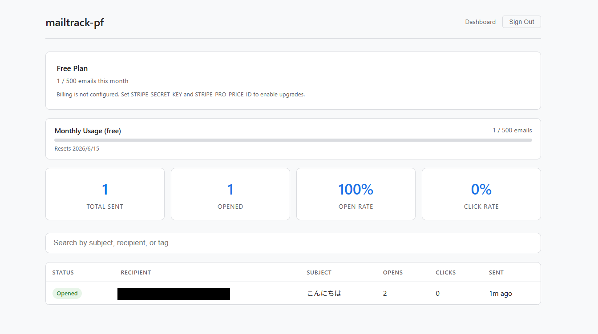

---

## Why I Built This

As a product manager handling daily business communications, I send dozens of emails daily — project updates to executives, coordination with 74-person teams, follow-ups with external partners. I had no idea if anyone actually read them.

I was spending **2-3 hours per week** calling and Slack-messaging people just to confirm they'd seen my email. The existing solutions didn't work for me: Mailtrack and MailSuite cost $5-10/month per account, and worse, they route your tracking data through their servers. For someone handling sensitive business communications and job applications, that was a non-starter.

So I built my own. The technical bet was to go **all-in on Cloudflare's free tier** — Workers for the API, D1 (SQLite at the edge) for storage, Pages for the dashboard. The entire stack costs $0/month with ~1000x headroom on every quota. I chose **AGPLv3** specifically to prevent proprietary SaaS forks while keeping the code freely available for self-hosting — the same model that works for Plausible Analytics and Cal.com.

What surprised me most during development:

- **Gmail's image proxy** caches tracking pixels, making repeat-open detection unreliable. This is a fundamental limitation of pixel-based tracking that no tool can fully solve.
- **Recipient privacy controls actually work.** Apple Mail Privacy Protection, image-blocking, and Proton Mail all defeat tracking trivially. I documented this prominently because I believe recipients should always retain control.
- **The ethics section took longer than the API.** Writing the Prohibited Use policy and GDPR compliance documentation was harder than implementing the 12 API endpoints. But it's the part I'm most proud of — this tool would be irresponsible without it.

Built in one week as a solo PM. 29 tests, TypeScript strict mode, CI green. The entire development process is documented in ADRs and a [Claude Code case study](docs/CLAUDE-CODE-CASE-STUDY.md).

---

## 🏗️ Architecture

```
┌─────────────────────┐    ┌─────────────────────┐
│  Chrome Extension   │    │  Recipient Inbox    │
│  (Gmail MV3)        │    │  (opens / clicks)   │
└──────────┬──────────┘    └──────────┬──────────┘
           │ POST /api/emails         │ GET /pixel, /r
           ↓                          ↓
       ┌──────────────────────────────────────┐
       │       Cloudflare Workers (Hono)      │
       │  API · pixel handler · redirector    │
       └──────────────────┬───────────────────┘
                          │ Drizzle ORM
                          ↓
                  ┌───────────────┐      ┌──────────────────┐
                  │  Cloudflare   │ ───→ │  React Dashboard │
                  │  D1 (SQLite)  │      │  on CF Pages     │
                  └───────────────┘      └──────────────────┘
```

**Entire stack runs on Cloudflare. Edge-level DB access keeps pixel response P95 < 30ms.**

---

## 📦 Features

### API (Cloudflare Workers + Hono) v0.3.0
- `POST /api/emails` — Register email; returns tracking_id, pixel URL, tracked links, and opt-out URL
- `GET /pixel/:id.gif` — Serve 1×1 transparent GIF + record open event (IP is SHA-256 hashed)
- `GET /r/:id` — 302 redirect to original URL + record click event
- `GET /api/emails` — List sent emails with open/click counts (paginated)
- `GET /api/emails/:id` — Email detail with open timeline + per-link click counts
- `POST /api/emails/:id/optout` — Recipient opt-out (API)
- `GET/POST /optout/:emailId` — Public opt-out page for recipients (no auth required)
- `GET /api/account/usage` — Monthly send count / limit
- `DELETE /api/account/data` — GDPR data deletion
- `GET /api/account/data` — GDPR data export
- `POST /api/auth/*` — Better Auth authentication (hosted mode)
- `GET /privacy` — Privacy policy
- `GET /terms` — Terms of service

### Chrome Extension (Manifest V3)
- Track ON/OFF toggle button in Gmail Compose
- Auto-injects tracking pixel + rewrites URLs on send
- ✓ (unread) / ✓✓ (read) status icons in Sent folder
- Settings popup (API URL, API Key, Slack Webhook)

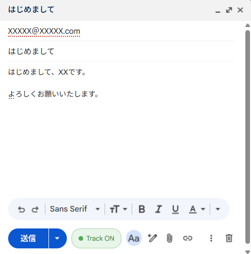

### Dashboard (React + Vite)
- Chronological email send history
- Per-email open timeline (UserAgent + Gmail Proxy detection)
- Aggregate open rate / click rate
- Search and filter by recipient, subject, or tag

### Multi-Tenant Auth (Phase 2)
- Better Auth integration (email/password + Google OAuth)
- API key auth for Chrome extension (SHA-256 hashed storage)
- `HOSTING_MODE` toggle: self (OSS) / hosted (official)
- Monthly send limits (free: 500/month, new accounts: 10/24h)
- Auto-ban (suspended after 10+ opt-outs)
- GDPR data deletion and export

### Observability & Security
- X-Request-ID / X-Response-Time headers
- Rate limiting (100 req/min per IP)
- Slack webhook open notifications (throttled to 1/hour per email)
- CORS origin restriction (`ALLOWED_ORIGINS` env var)
- Cloudflare Workers Analytics (enabled in wrangler.toml)

---

## 💰 Zero-Cost Infrastructure

| Service | Free Tier | Expected Use | Headroom |
|---|---|---|---|
| Cloudflare Workers | 100K req/day | 100 req/day | **1000×** |
| Cloudflare D1 | 5GB · 5M reads/day | < 1MB · 100 reads/day | **50,000×** |
| Cloudflare Pages | Unlimited bandwidth · 500 builds/month | 30 builds/month | **16×** |
| GitHub Public | Unlimited | — | ∞ |

**Total: $0/month. Saves $180–$864 over 3 years vs SaaS competitors ([ADR-002](docs/ADR-002-free-tier-operations.md))**

---

## 🛠️ Tech Stack

| Layer | Technology |
|---|---|
| Chrome Extension | Manifest V3 · Service Worker · Content Script |
| API | Cloudflare Workers · Hono v4 |
| DB | Cloudflare D1 (SQLite) · Drizzle ORM |
| Dashboard | React 19 · Vite 6 · Cloudflare Pages |
| Monorepo | Turborepo · pnpm |
| Auth | Better Auth (direct D1 connection) |
| Testing | Vitest · @cloudflare/vitest-pool-workers (29 tests) |
| Observability | X-Request-ID · X-Response-Time · Workers Analytics |
| CI/CD | GitHub Actions |
| License | AGPL-3.0-or-later |

---

## 🚀 Setup

### One-Click Deploy (Fork & Deploy)

1. Fork this repo
2. Add GitHub Secrets: `CLOUDFLARE_API_TOKEN`, `CLOUDFLARE_ACCOUNT_ID`
3. Go to Actions → "Deploy to Cloudflare" → Run workflow

### Manual Setup

```bash
# Clone
git clone https://github.com/dkamehat/pixletter.git
cd pixletter
pnpm install

# Cloudflare D1 Setup
pnpm wrangler login
pnpm wrangler d1 create pixletter-db
# → Update database_id in wrangler.toml

# Migrations
pnpm db:generate
pnpm db:migrate:local    # Local D1
pnpm db:migrate:remote   # Production D1
pnpm db:seed:self        # Seed self tenant + user

# Start dev server
pnpm dev

# Run tests
pnpm test
pnpm type-check

# Install Chrome Extension
# 1. Open chrome://extensions
# 2. Enable Developer Mode
# 3. Click "Load unpacked" and select apps/extension/
```

See [SETUP.md](SETUP.md) for details.

---

## 📸 Screenshots

### Landing & Sign In
| Landing | Google Login |
|---------|-------------|
| 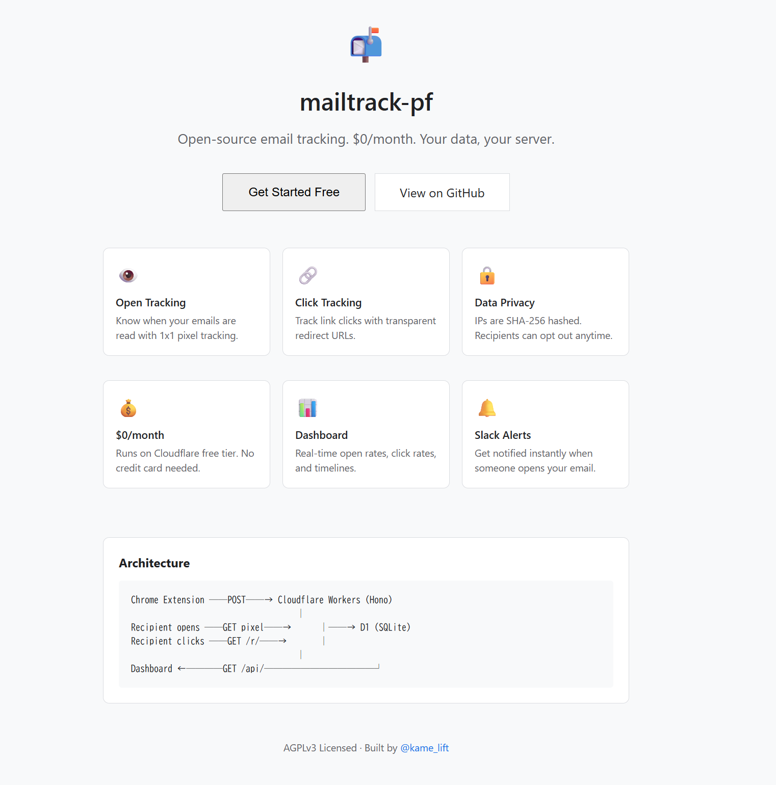 | 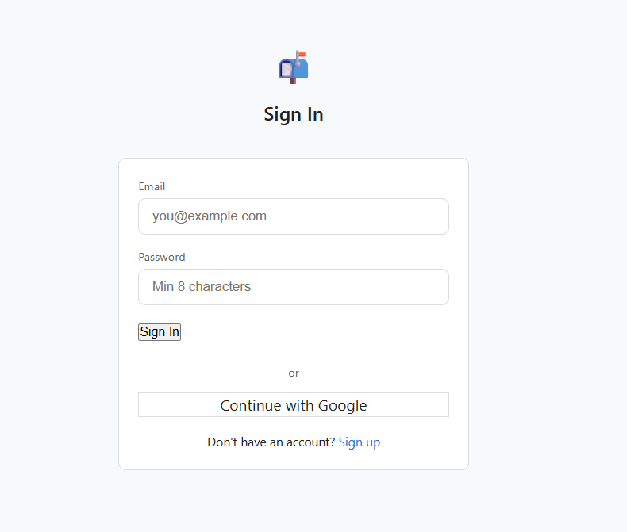 |

### Onboarding (3 steps)
| 1. Generate API Key | 2. Install Extension | 3. Send Test Email |
|---------------------|---------------------|-------------------|
|  | 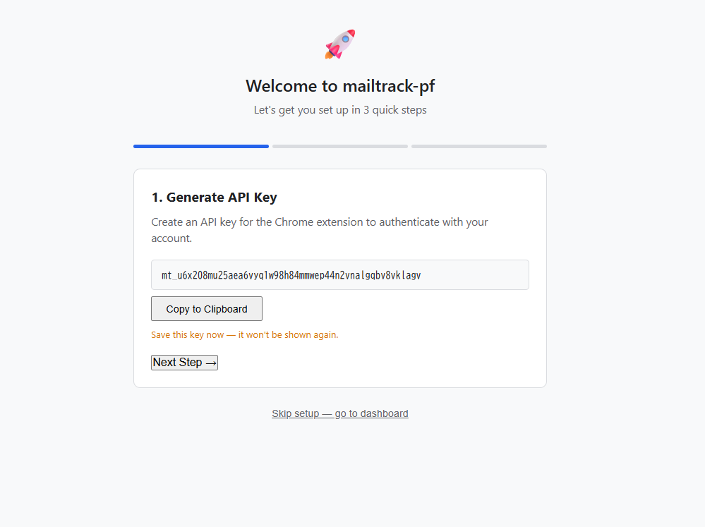 | 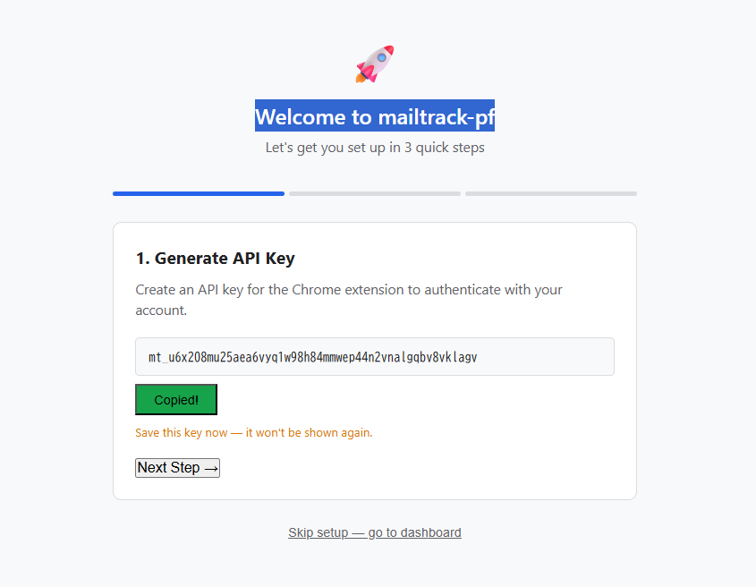 |

### Chrome Extension
| Extension Popup | Chrome Extensions Page |
|----------------|----------------------|
| 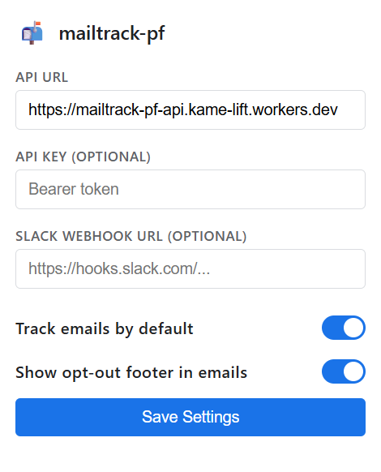 | 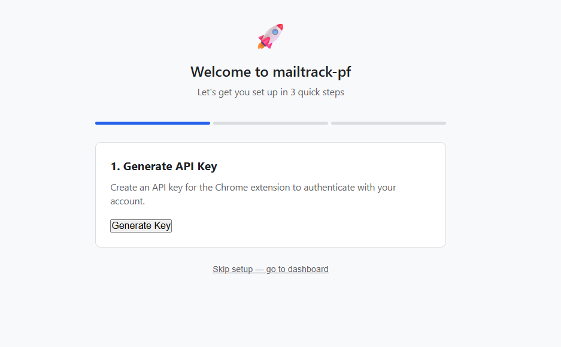 |

### Gmail & Dashboard
| Gmail Compose (Track ON) | Dashboard |
|--------------------------|-----------|
|  |  |

### Privacy Controls
| Opt-out Page | Opted Out | Already Opted Out |
|-------------|-----------|-------------------|
| 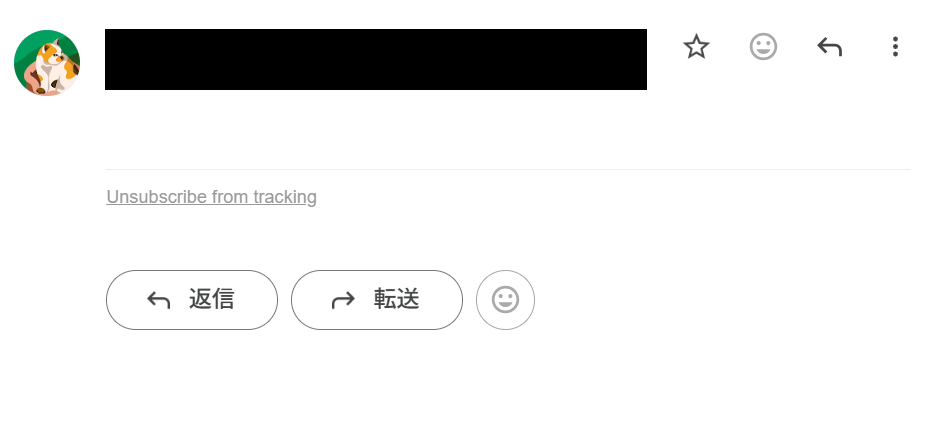 | 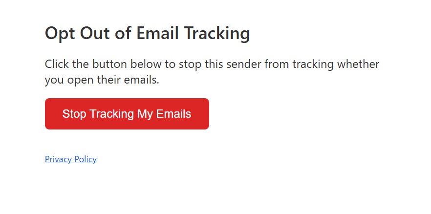 | 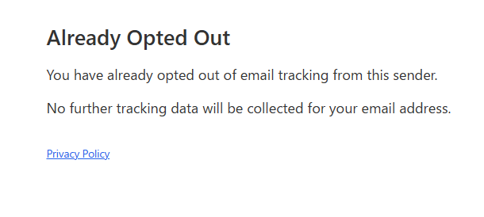 |

---

## 📚 Documentation

| Document | Description |
|---|---|
| [ADR-001](docs/ADR-001-stack-selection.md) | Technical stack selection ADR |
| [ADR-002](docs/ADR-002-free-tier-operations.md) | Free-tier operations ADR |
| [ADR-003](docs/phase2/ADR-003-multi-tenant-architecture.md) | Multi-tenant architecture |
| [ADR-004](docs/phase2/ADR-004-oss-licensing-and-hosting-model.md) | AGPLv3 licensing rationale |
| [CHECKLIST.md](CHECKLIST.md) | Day 1 execution checklist |
| [API-REFERENCE.md](docs/API-REFERENCE.md) | API reference |
| [GOOGLE-OAUTH-SETUP.md](docs/GOOGLE-OAUTH-SETUP.md) | Google OAuth setup guide |
| [SELF-HOST-GUIDE.md](docs/SELF-HOST-GUIDE.md) | Self-hosting guide |
| [CLAUDE-CODE-CASE-STUDY.md](docs/CLAUDE-CODE-CASE-STUDY.md) | Claude Code case study |

---

## ⚠️ Responsible Use & Legal Considerations

Email tracking is a legally and ethically sensitive practice. This tool is designed for legitimate use cases only.

### Intended Use Cases
- Tracking opens/clicks on **your own** sent emails (e.g., follow-up timing)
- Marketing emails where recipients have **explicitly opted in** to receive communications
- Internal team communications where tracking is disclosed in advance

### Prohibited Use

**The following uses violate the intended use of this software:**

- **Intimate partner surveillance** — tracking emails to monitor a partner's behavior (potential DV/abuse vector)
- **Non-consensual employee monitoring** — tracking employee emails without informed written consent
- **Journalist/activist/source tracking** — any use that could compromise press freedom or endanger individuals
- **Stalking or harassment** — using tracking data to intimidate, threaten, or harass recipients
- **Mass unsolicited email tracking** — attaching tracking pixels to spam or bulk unsolicited emails

If you become aware of such misuse, please report it via GitHub Issues.

> **Note:** While this software is AGPLv3-licensed, the authors strongly request that users honor the prohibited uses listed above as a matter of ethics. Reports of prohibited use will result in public disavowal and removal of support.

### Privacy & Compliance

- **GDPR (EU)**: The sender must inform recipients that tracking is in use. IP addresses are pseudonymized via SHA-256 hashing (not fully anonymized; this enables deduplication while reducing direct PII exposure). Full data deletion available via [`DELETE /api/account/data`](apps/api/src/routes/gdpr.ts) (GDPR Article 17).
- **APPI (Japan)**: Raw IP addresses are never stored — only SHA-256 [pseudonymized hashes](apps/api/src/lib/hash.ts). Email body content is never stored.
- **CAN-SPAM (US)**: Opt-out mechanism is mandatory for commercial emails. This tool provides a [one-click opt-out page](apps/api/src/routes/optout.ts) at `/optout/:emailId`.

### Recipients Can Block Tracking

Pixel-based email tracking is **trivially bypassed** by recipients. This is by design — recipients always retain control:

- Disable "Load remote images" in their email client
- Use Apple Mail Privacy Protection (pre-fetches all images via proxy)
- Use a VPN or Tor
- Use email clients that strip tracking pixels (e.g., Hey, Proton Mail)

**Gmail Image Proxy**: Google caches images, which may result in a single open being recorded regardless of actual open count. This is a known limitation of all pixel-based tracking systems.

These are not bugs — they are features that protect recipient autonomy.


### Built-in Safeguards

These are not just policies — they are **enforced in code**:

- **Opt-out link in every email**: The API response always includes an `optoutUrl` and `optoutHtml` footer. In hosted mode, injection is [forced regardless of user settings](apps/api/src/routes/emails.ts#L176). Recipients can stop tracking with one click.
- **Notification rate limiting**: Slack open notifications are [suppressed within a 1-hour window](apps/api/src/lib/notify.ts#L17) per email to prevent notification spam.
- **Auto-ban on abuse**: Accounts receiving [more than 10 opt-outs are automatically suspended](apps/api/src/lib/abuse.ts#L6). No manual intervention required.

### Data Storage

- All data stored in **Cloudflare D1** (SQLite) in the region you deploy to
- IP addresses are **pseudonymized** (SHA-256 hash) — never stored raw
- Email body content is **never stored** — only metadata (subject, recipient, timestamps)
- Recipients can opt out at any time via `/optout/:emailId`
- Full data export and deletion via [`/api/account/data`](apps/api/src/routes/gdpr.ts)

### Security

Known dev-dependency vulnerabilities (wrangler 3.x, undici, esbuild) do not affect production runtime (Cloudflare Workers). See [SECURITY.md](SECURITY.md) for detailed analysis.

### Disclaimer & Your Responsibility

THIS SOFTWARE IS PROVIDED "AS IS", WITHOUT WARRANTY OF ANY KIND, EXPRESS OR IMPLIED. THE AUTHORS ARE NOT LIABLE FOR ANY CLAIM, DAMAGES, OR OTHER LIABILITY ARISING FROM THE USE OF THIS SOFTWARE.

By deploying or using pixletter, you acknowledge:

1. **You are solely responsible** for compliance with all applicable laws (GDPR, CAN-SPAM, APPI, etc.) in every jurisdiction where your recipients are located.
2. **You must inform recipients** where legally required. The tool provides opt-out mechanisms, but the legal obligation to disclose tracking rests with you, not the software authors.
3. **The authors do not provide legal advice.** Consult a qualified attorney for compliance guidance specific to your use case and jurisdiction.
4. **Abuse reports may result in public identification.** If prohibited use (as defined above) is reported and verified, the authors reserve the right to publicly disavow the deployment.

This disclaimer supplements, and does not replace, the [AGPLv3 license terms](LICENSE).

---

## 🔄 Data Flow & Retention

### Data Flow

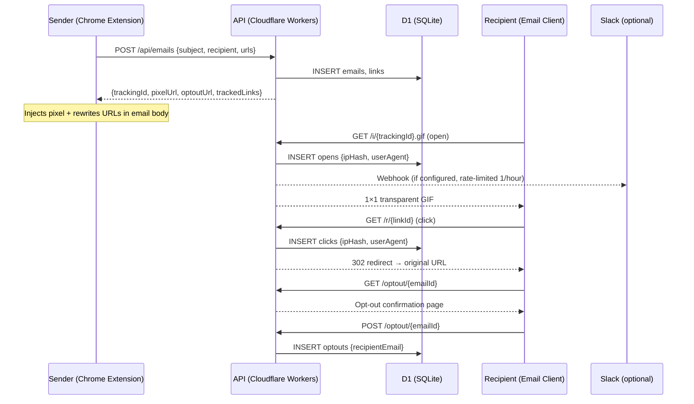

### Data Retention

| Data | Retention | Deletion Trigger |
|------|-----------|------------------|
| Email metadata (subject, recipient, timestamps) | Until account deletion | `DELETE /api/account/data` |
| Open events (ipHash, userAgent, timestamp) | Until account deletion | `DELETE /api/account/data` |
| Click events (ipHash, userAgent, timestamp) | Until account deletion | `DELETE /api/account/data` |
| Link mappings (originalUrl, trackingId) | Until account deletion | `DELETE /api/account/data` |
| Opt-out records (recipientEmail) | Permanent | Never deleted (recipient protection) |
| Auth sessions | Expires after inactivity | Better Auth session expiry |
| Monthly send counter | Resets every 30 days | Automatic on reset_at |
| Tenant record (on deletion) | Soft-deleted | isSuspended=true, name set to [deleted] |

### What is NOT stored

- ❌ Email body content (only subject line)
- ❌ Raw IP addresses (only SHA-256 pseudonymized hashes)
- ❌ Attachment data
- ❌ Recipient email content or inbox data

### Deletion Cascade

`DELETE /api/account/data` performs cascading deletion in FK order:

`clicks → opens → links → emails → optouts → apiKeys → users → tenant (soft-delete)`

All tracking data is permanently removed. The tenant record is preserved in suspended state for audit purposes only.

### GDPR Data Export — Sample Response

```json
{
  "exportedAt": "2026-01-15T10:30:00.000Z",
  "tenant": {
    "id": "txxxxxxxxxxxxxxxxxxx",
    "name": "Alice Example",
    "plan": "free",
    "monthlyEmailLimit": 500,
    "monthlyEmailCount": 12,
    "resetAt": "2026-02-15T10:30:00.000Z",
    "isSuspended": false,
    "createdAt": "2025-12-15T10:30:00.000Z"
  },
  "emails": [
    {
      "id": "emxxxxxxxxxxxxxxxxxx",
      "trackingId": "trxxxxxxxxxxxxxxxxxx",
      "subject": "Project status update",
      "recipient": "bob@example.com",
      "recipientName": "Bob",
      "sentAt": "2026-01-15T09:00:00.000Z"
    }
  ],
  "opens": [
    {
      "id": "opxxxxxxxxxxxxxxxxxx",
      "emailId": "emxxxxxxxxxxxxxxxxxx",
      "userAgent": "Mozilla/5.0 ...",
      "ipHash": "a1b2c3d4...(SHA-256)",
      "isGmailProxy": false,
      "openedAt": "2026-01-15T09:05:00.000Z"
    }
  ],
  "clicks": [],
  "links": [],
  "optouts": []
}
```

---

## 📅 Roadmap

- [x] **Day 1**: PRD, ADRs, DB schema, monorepo init, D1 setup
- [x] **Day 2**: Workers API implementation (6 endpoints) + Vitest
- [x] **Day 3**: Chrome extension MV3 (Track toggle, pixel injection, URL rewriting)
- [x] **Day 4**: Sent folder ✓✓ icons + React dashboard
- [x] **Day 5**: Slack notifications + rate limiting
- [x] **Day 6**: Observability (Request-ID, Response-Time) + test expansion (5→18)
- [x] **Day 7**: README polish + public release

### Phase 2: OSS Release + Official Hosting
- [x] Better Auth multi-tenant authentication (ba_user/session/account/verification)
- [x] Sign up → automatic tenant creation (databaseHooks)
- [x] Dynamic tenant_id in tracking.ts
- [x] Monthly send limits + 24h new-account restriction
- [x] Forced opt-out URL injection + public opt-out page
- [x] Auto-ban (suspended after 10+ opt-outs)
- [x] GDPR data deletion / export API
- [x] Privacy policy + terms of service
- [x] Landing page + Sign up / Login UI
- [x] Usage dashboard (UsageBanner)
- [x] Deploy to Cloudflare button
- [x] Onboarding flow
- [ ] `npx create-pixletter@latest` setup wizard
- [ ] Documentation site

---

## 📄 License

AGPL-3.0-or-later.

AGPLv3 was chosen to ensure improvements remain open-source even when deployed as a hosted service. Proprietary SaaS forks must publish modifications. This protects the OSS ecosystem while keeping code freely available for self-hosting. See [ADR-004](docs/phase2/ADR-004-oss-licensing-and-hosting-model.md) for the full rationale.

---

## 🙋 Author

Built by [@kame__lift](https://x.com/kame__lift)
